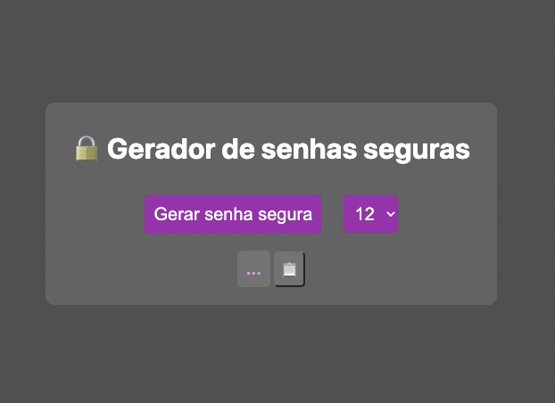

<!-- PROJECT LOGO -->
 

  
  
  

    Gerador De Senhas 
     
  

  <!-- Brinque -->
<a href="https://gerador-senhas-nine.vercel.app/" style="color:#66FF00; font-size:25px">
    Teste o projeto! Link do deploy 🔑
  </a>
   

 

# Sobre o projeto

Trata-se de um gerador de senhas aleatórias, com o número de caracteres gerados podendo ser variado entre 3 e 12.

Nesse projeto foi utilizada a biblioteca `nanoid`, que é extremamente leve e consegue gerar uma sequência de caracteres aleatórios.

Existem diversas vantagens em utilizar uma biblioteca externa. Além de economizarmos tempo e linha código, bibliotecas populares recebem constantes atualizações e bugfixes, deixando nosso código mais seguro e performático.

 👀 Outras curiosidades, como a probabilidade de se advinhar as senhas, podem ser conferidas nesse <a href="https://zelark.github.io/nano-id-cc/">link</a>.

 

# Tecnologias utilizadas

Essas foram as tecnologias utilizadas durante o desenvolvimento do projeto:

* HTML
* CSS
* Javascript
* Vite
* ESLint
